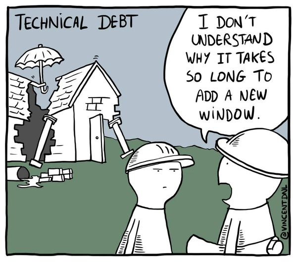

# OpenGuild Community Calls

<pba-flex center>

03-05-2024

</pba-flex>

---

## OpenGuild introduction

Notes:
OpenGuild is an open-source community for Web3 builders interested in the Polkadot ecosystem and Web3 in general. By joining OpenGuild, you will have the opportunity to directly engage with Polkadot development tools, expand your network, and participate in Web3-related events organized by OpenGuild. 🙌 Cheers for your understanding and for being part of this OpenGuild community.

---

## Today's agenda

* Technical debt in software development
* How Polkadot's Infrastructure prevent technical debt
* JAM upgrade
* PBA remote

---

## Technical debt in software development

---

* Messy or Complicated Code
* Skipping Testing Phases
* Outdated Technology
* Lack of Scalability

Notes:

Nợ kỹ thuật (technical debt) là một khái niệm trong phát triển phần mềm, dùng để mô tả tình trạng mà ở đó một nhóm phát triển chọn phương án thiết kế hoặc triển khai tạm thời có thể không tối ưu để đáp ứng các mục tiêu ngắn hạn như gặp deadline hay phát hành sản phẩm sớm. Tuy nhiên, các giải pháp này sau này có thể dẫn đến chi phí cao hơn về mặt bảo trì và cập nhật.

Cụ thể hơn, nợ kỹ thuật có thể bao gồm:

- Mã nguồn lộn xộn hoặc khó hiểu: Việc viết code nhanh để kịp tiến độ dẫn đến việc sử dụng các kỹ thuật không chuẩn hoặc thiếu tài liệu, khiến cho mã nguồn khó được bảo trì hoặc nâng cấp.
- Bỏ qua các công đoạn kiểm thử: Khi áp lực deadline lớn, đội ngũ có thể bỏ qua việc kiểm thử đầy đủ để tiết kiệm thời gian, điều này có thể dẫn đến lỗi phần mềm không được phát hiện kịp thời.
- Sử dụng công nghệ hoặc thư viện lỗi thời: Đôi khi việc chọn sử dụng công nghệ hoặc thư viện không còn được cập nhật để phát triển phần mềm cũng tạo ra nợ kỹ thuật do sau này sẽ khó khăn trong việc tích hợp và nâng cấp.
- Thiếu tính mở rộng: Giải pháp được triển khai có thể chỉ phục vụ được yêu cầu hiện tại mà không dễ dàng thích ứng với các yêu cầu phát triển trong tương lai.

Giống như nợ tài chính, nợ kỹ thuật nếu không được quản lý và thanh toán kịp thời sẽ tích tụ lãi và có thể gây ra các vấn đề nghiêm trọng trong phát triển phần mềm về lâu dài. Việc giải quyết nợ kỹ thuật thường đòi hỏi đầu tư thời gian và nguồn lực để cải tiến mã nguồn và cấu trúc hệ thống, điều này vừa cần thiết vừa thường xuyên được ưu tiên trong các dự án lớn.

---

## How Polkadot's Infrastructure prevent technical debt

---

* Modularization
* Advanced Consensus Mechanism (NPoS)
* On-Chain Updates and Upgrades
* Integration and Scalability
* Community and Development Support

Notes:
- Modularization: Polkadot áp dụng cách tiếp cận modular hóa trong thiết kế của mình. Cách tiếp cận này không chỉ giúp dễ dàng bảo trì và nâng cấp hệ thống mà còn cho phép các nhà phát triển tập trung vào việc cải thiện các module cụ thể mà không ảnh hưởng đến hoạt động của toàn bộ hệ thống.
- Cơ Chế Consensus Nâng Cao: Polkadot sử dụng thuật toán đồng thuận NPoS (Nominated Proof-of-Stake), không chỉ tăng cường an toàn và bảo mật cho hệ thống mà còn giảm bớt khối lượng công việc phải xử lý, giảm thiểu nợ kỹ thuật phát sinh do thiết kế hệ thống không linh hoạt.
- Cập Nhật và Nâng Cấp On-Chain: Khả năng cập nhật và nâng cấp hệ thống một cách minh bạch và liền mạch mà không cần phải tạm dừng hoạt động là một trong những điểm nổi bật của Polkadot. Điều này giảm thiểu rủi ro về nợ kỹ thuật bằng cách cho phép sửa đổi kịp thời và hiệu quả các vấn đề kỹ thuật hoặc bảo mật mà không làm gián đoạn hoạt động của hệ thống.
- Khả Năng Tích Hợp và Mở Rộng: Kiến trúc của Polkadot cho phép các blockchain khác nhau kết nối với hệ thống thông qua parachains hoặc bridges. Điều này không chỉ tạo điều kiện cho sự đa dạng và mở rộng mà còn giúp giảm bớt nợ kỹ thuật bằng cách chia sẻ và tận dụng các giải pháp đã được thử nghiệm và tối ưu.
- Cộng Đồng và Hỗ Trợ Phát Triển: Polkadot khuyến khích sự tham gia của cộng đồng thông qua các chương trình như Web3 Foundation Grants Program, nơi hỗ trợ tài chính cho các dự án nhằm giải quyết các vấn đề kỹ thuật và phát triển công nghệ. Sự hỗ trợ này giúp giảm thiểu nợ kỹ thuật bằng cách đảm bảo rằng các giải pháp mới được đánh giá kỹ lưỡng và tích hợp một cách suôn sẻ vào hệ thống.

---

## JAM upgrade

Notes:
Jam sẽ active vào cuối năm, việc migrate lên jam thì cẩn 15 phút, cùng lắm là 4 tiếng đồng hồ cho tất cả các parachain.

---

## PBA remote

