# OpenGuild Community Calls

<pba-flex center>

09/08/2024

</pba-flex>

---

## OpenGuild introduction

Notes:
OpenGuild is an open-source community for Web3 builders interested in the Polkadot ecosystem and Web3 in general. By joining OpenGuild, you will have the opportunity to directly engage with Polkadot development tools, expand your network, and participate in Web3-related events organized by OpenGuild. 🙌 Cheers for your understanding and for being part of this OpenGuild community.

---

## Web3 Cyber Security

Notes:
Xin chào tất cả mọi người, trước tiên em xin cám ơn mọi người vì có cơ hội được tham dự sự kiện này ngày hôm nay. 
Chủ đề bọn e sẽ thuyết trình ngày hôm nay là về bảo mật, an toàn an ninh mạng trong hệ sinh thái web3

---

Notes:
Vì sao chúng ta cần quan tâm đến vấn đề bảo mật trên hệ sinh thái của web3.
Trong slide này có một số thống kê từ khoảng 2014 đến 2021 về những vụ hack trong defi. Và với vụ hack lớn nhất lên đến 611tr usd

---

## Crypto investors lost  nearly $4 billion to hackers in 2022

Notes:
và những đề bảo mật cũng gây thiệt hại rất lớn cho các nhà đầu tư. các nhà đầu tư mất 4 tỷ trong 2022

Ở slide này chúng ta thêm 1 số thống kê của các sự kiện gần đây hơn. Từ 2021 đến quý 1 của 2022, đã có 2 vụ hack lên đến hơn 600tr

và trong tháng 10 2022, số tiền bị hack đã gần chạm ngưỡng 800tr

---

Notes:
và tiến đến thời điểm gần đây hơn, trong quý 1 của 2023, tổng số tiền bị hack trong hệ sinh thái web3 đã lên tới hơn 400tr 

có rất nhiều dự án uy tín cũng nhưng là có trình độ cao, tuy nhiên do thiếu đầu tư vào yếu tố bảo mật nên đã thất bại

---

## Smart contract security

* Smart Contract Exploits
* Oracle exploits
* Randomness Exploits
* Cross-chain exploits
* Web3 security best practices

Notes:
Bài thuyết trình này của bọn e sẽ chia làm 2 phần, phần đầu tiên sẽ tập trung về các vấn đề bảo mật onchain. Phần đầu sẽ bao gồm: ... 

---

## BEYOND Smart contract security

* WebApp Frontend Attacks
* Private Keys & Seed Phases theft 
* Traditional Vulnerabilities 
* Administrative issues

Notes:
Phan 2 se noi ve các vấn đề bảo mật offchain. Những vấn đề xảy ra trong một công ty phát triển các sản phẩm web3. Chúng ta có thể giả định những trường hợp này xảy ra khi mà các vấn đề onchain đã được đảm bảo.

---

## Smart contract EXPLOITS

Notes:
Những lỗ hổng trong hợp đồng thông minh

---

## Smart contract EXPLOITS

Two main sources of security problems:
* Bugs in the blockchain infrastructure Protocols
* Bugs or Vulnerabilities in the smartcontract code
      Developer mistakes or unanticipated code execution

Notes:
2 vấn đề về bảo mật lớn nhất trong smart contract là lỗi ở tầng kiến trúc và lỗi ở tầng ứng dụng.

trong bài thuyết trình chúng ta sẽ giả định là mọi chạy ổn ở tầng ứng dụng và sẻ chỉ tập trung vào các vấn đề ở tầng ứng dụng thôi. 

---

* Programming smart contracts requires a different  programming mindset
* The cost of failure can be high 
* Changes can be difficult
* Similar to hardware development

Notes:
Lập trình smart contract yêu cầu kỹ năng khác với lập trình thông thường. 
mọi sai lầm đều phải trả giá rất đắt
rất khó thay đổi, tương tự như phát triển phần cứng

---

When someone finds an unintentional flaw in smart contract code, that when combined with the nuances of the blockchain network running the smart contract, allows an exploiter to manipulate the outcome of the smart contract to their advantage, and often to the detriment of other users

Notes:
Do tính minh bạch của hợp đồng thông minh nên ai cũng có thể đọc code được. 

Khi ai đó tìm thấy một lỗ hổng vô ý trong mã hợp đồng thông minh, khi kết hợp với các sắc thái của mạng blockchain chạy hợp đồng thông minh, sẽ cho phép kẻ khai thác thao túng kết quả của hợp đồng thông minh để có lợi cho họ và thường gây bất lợi cho những người dùng khác.

---

* Re-entrancy attack
* Race Conditions/Front Running
* DoS attack
* Overflow/Underflow 
* delegateCall (EVM)
* TxOrigin (EVM)
* Unexpected Ether (EVM)
* Timestamp Manipulation

Notes:
một số lỗ hổng phổ biến trong lập trình solidity 

Để đi về chi tiết từng lỗ hổng thì chúng ta sẽ cần khá nhiều thời gian, và có thể cần một buổi workshop riêng 

---

## Reentrancy

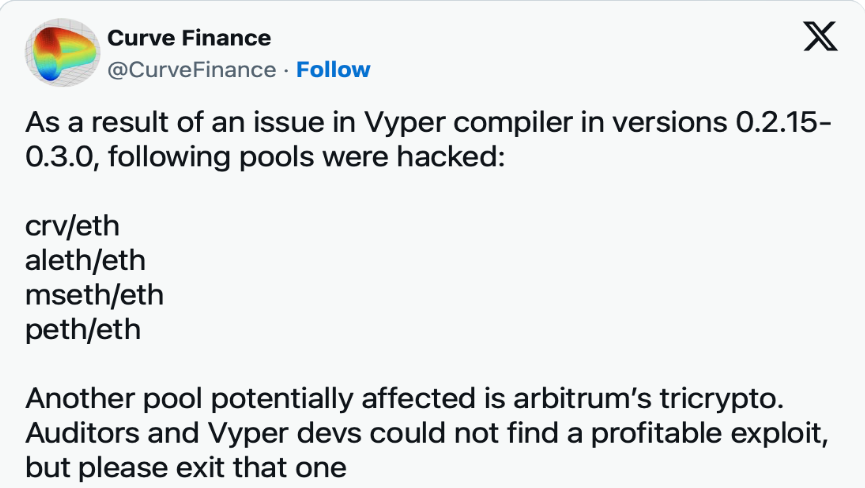

Notes:
trong các lỗi vừa nêu thì e muốn lấy ví dụ thêm về lỗi reentrancy 

mặc dù developer đã làm theo best practice về bảo mật, nhưng lỗi ở compiler 

---

## Oracle Exploits

Notes:
giải thích thêm về oracle, 
oracle giúp call api lấy dữ liệu offchain 

---

Exploits that occur due to bad or incorrect data provided by Oracles:
* Flash Loan Attacks
* Low quality data Oracle attack
* Single feed or exchange
* Using a DEX or AMM reserves

Notes:
các lỗi tấn công oracle

---

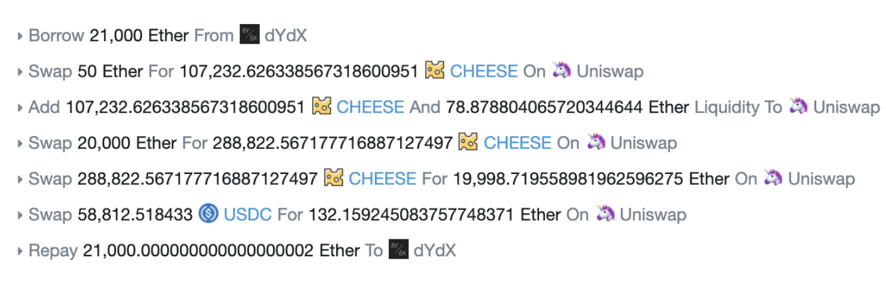

---

## Oracle exploits: Price Oracle attacks

Exploits that occur due to using bad data orcentralized data sources
* Using a single oracle or single data source
* Using DEX or AMM reserves for price data 
* Using TWAP for price data

Notes:
TWAP: lấy nhiều nguồn giá rồi lấy giá trung bình 

---

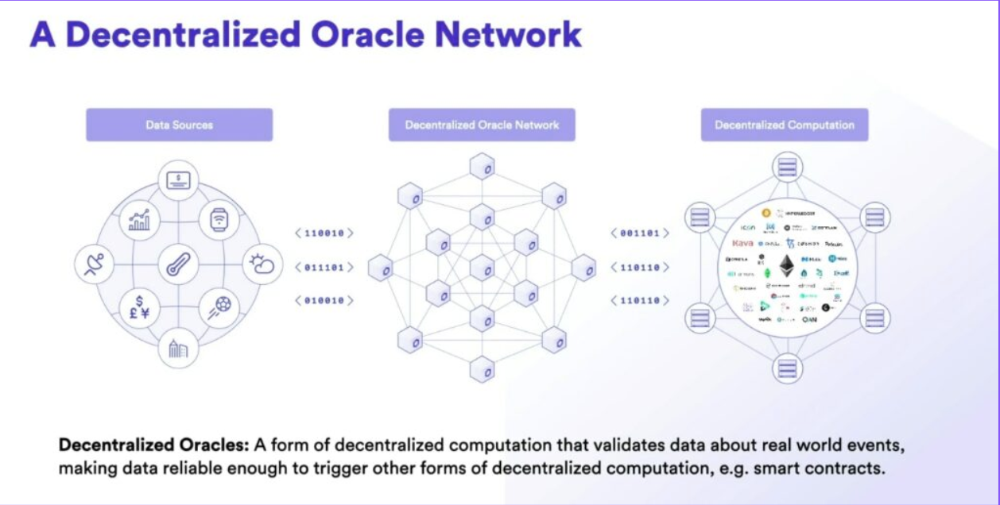

Notes:
giải pháp là sử dụng mạng oracle phi tập trung

---

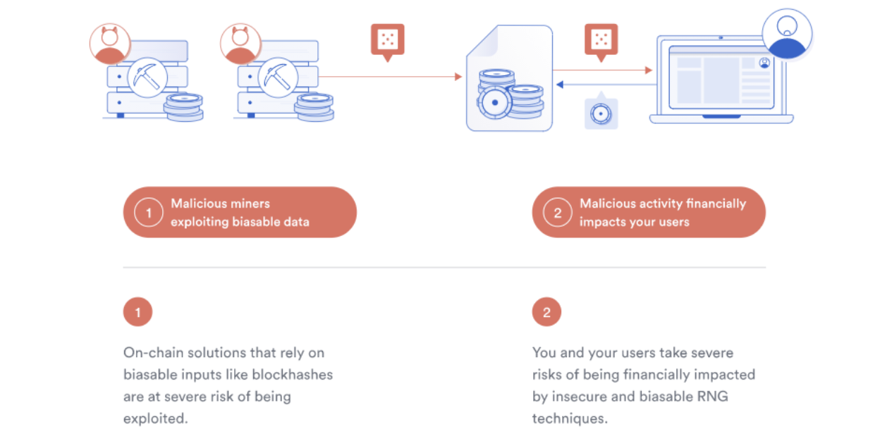

Notes:
lấy số ngẫu nhiên onchain cũng rất là nguy hiểm 

---

## Randomness Exploits: Solution

Provably fair > Probably fair

---

Use a provably random number generator or your source of randomness
* Chainlink VRF
* Phala VRF

---

## Cross-chain Exploits

Notes:
Tiếp theo là những lỗ hổng trong cross chain 

---

* Cross-chain is new
* Occur when a malicious actor takes advantage of cross-chain protocols to steal funds 
* By 'mintingor taking funds minted on one chain, leaving the collateral on the other chain underwater

---

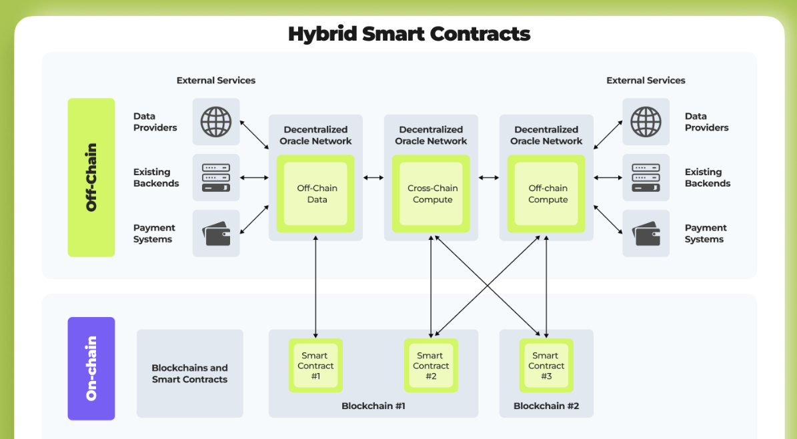

---

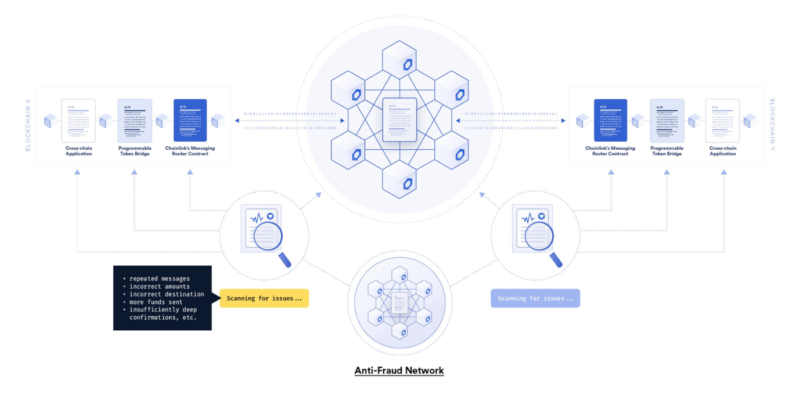

---

## Security Best Practices

---

## Testing Your Smart Contracts

1. Rule of thumb: Every line of contract logic should have a corresponding text
2. The most important scenarios should be tested thoroughly
3. Tests can catch careless mistakes
4. Tests are great for edge cases

---

## Testing Tools

1. Static Analysis tools can help you find bugs Silther
2. Solidity coverage reports can help

---

## Fixing Issues: Shipping a New Version

1. Smart contracts are immutable
2. Sometimes when a bug or vulnerability is found, developers ship a new version
   * Maintain immutability
   * Easy to audit
   * Usually requires some data migration

Notes:
Một số vấn đề phán sinh khi tìm thấy lỗi ở smart contract 

---

## Fixing Issues: Upgradeable Contracts

1. Contract deployments are setup in a way that allows for new versions to be deployed and used  without having to socialized them
2. Use the proxy design pattern
    * Users interact with the proxy contract
    * Allows "re-pointing" to a new underlying contract
3. Centralization considerations

---

## Kill Switch

1. A function that stops any further interactions with a smart contract Usually only executable by one or a small number of people
2. Great for preventing widespread issues in the event of a vulnerability being found
3. Centralization considerations

---

## Get External Audits

1. Security focused peer review
2. Can catch things that you (or internal reviews) have missed
3. They aren't a silver button solution
4. Multiple audits are better than one

---

## Keep Up with the Latest Security News

1. Awareness of new exploits as they're found Rekt.news Open Zeppelin forums

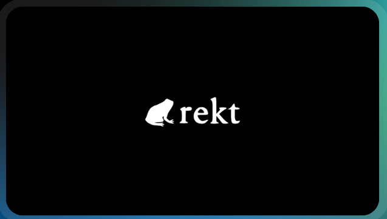

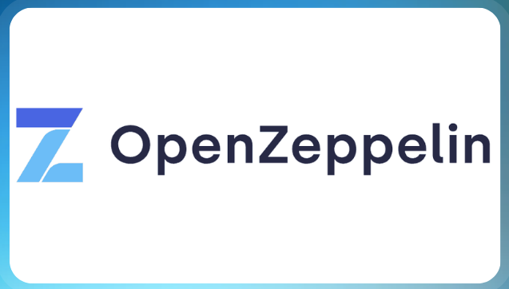

---

## Summary

1. Smart Contracts are unique compare to traditional programs
2. Security is paramount 
3. High level of security can be achieved
    * Awareness of currently known vulnerabilities
    * Learning from the past
    * Following best practices
    * Keeping up with the latest news

---

## Offchain security

* WebApp Frontend Attacks
* Private Keys and Seed Phases theft 
* Traditional Vulnerabilities 
* Administrative issues

---

## WebApp Frontend Attacks

---

## Front-end Phishing Attacks: Solutions

1. Be vigilant and aware of which smart contracts you signing transactions for
2. Keep an eye on Web3 socials
3. Don't sign any transactions with your wallet that you're not 100% sure
4. CORS

Notes:
 Phishing là 1 cách thức tấn công quen thuộc 
 Cẩn trọng với các đường link lạ 
 Hãy cẩn trọng với tất cả các hành động bắt bạn kí trên các ví
 Thêm CORS vào fe

---

## WebApp Frontend Attacks

1. Cross-Site Scripting (XSS)
2. DNS Hijacking
3. Malicious code injected via 3rd party library
4. Case studies: 
  * The BadgerDao hack - $120M stolen
  * Premint Hack - 17/7/2022 - $500,000 stolen
  * KLAYswap - $1.9M (BGP hijacking)

Note:
- Các kĩ thuật tấn công rất phổ biến kể cả với web2 như là xss, dns hijacking, hay việc bị nhúng các code độc hại thông qua các thư viện, chrome extention

---

## The BadgerDao hack

* BadgerDAO (BD) uses CloudFlare (CF)
* CF has a feature to add content to website(“workers”)
* [Aug 2021] Hackers used a vulnerability in CF to add API key to workers controlled by attackers 
* Required some mistakes on BD side too [Sep 2021] 
* Hackers are now able to inject code into BD’s web2 interface! 

Notes:
- Cloudfare là một dịch vụ CDN 
- CF có tính năng thêm vào website worker
- hacker tận dụng lỗ hổng trên CF để thêm API Key của kẻ tấn công vào CF 
- hacker thêm worker để inject script vào BadgerDAO website

---

## Injected script

Hooking Dapp communication with the wallet 

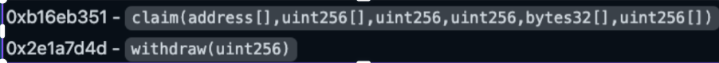

Notes:
- hacker thêm đoạn code để tương tác với ví của người dùng ví dụ như các hàm claim, withdraw,...

---

## Solutions

* Input Validation and Output Encoding
* Content Security Policy (CSP)
* Use Trusted Third-Party Libraries / Services
* HTTP-only and Secure Cookies
* Regular Security Updates

Notes:
- Luôn kiểm tra đầu vào và đầu ra luôn được encode cẩn thận 
- Sử dụng các chuẩn Content Security Policy của website
- Chỉ sử dụng các 3rd party libary hoặc services đủ uy tín và tin tưởng
- Bảo mật cookie bằng các rule như là HTTP only, secure flag và luôn set expire time hoặc dùng session một cách hợp lý 

---

## Private Keys and Seed Phases theft

---

* Attackers will phish users requesting that they input their backup seed phase
* Browser Extensions  has been found storing seed phases in clear text in some cases
* The private key stored on the backend server was theft during the attack.

Notes:

- Lấy cắp private keys hay seed phases là một trong những lỗi kinh điển với thiệt hại rất nặng nề
- Hacker lừa người dùng nhập vào backup seed phase ví của họ 
- Một vài các browser extensions cho wallet đã không mã hoá các seed phases 
- Trong một business không tránh khỏi việc phải tương tác với smart contract qua ví sở hữu hoặc ví có quyền đặc biệt, việc bảo mật private key trên server cũng tương tự việc bảo mật của web2

---

## Case Study: Slope Wallet Hack

* Slope Wallet sent seed phase in clear text to 3rd party service (Sentry)
* $4.1M was stolen

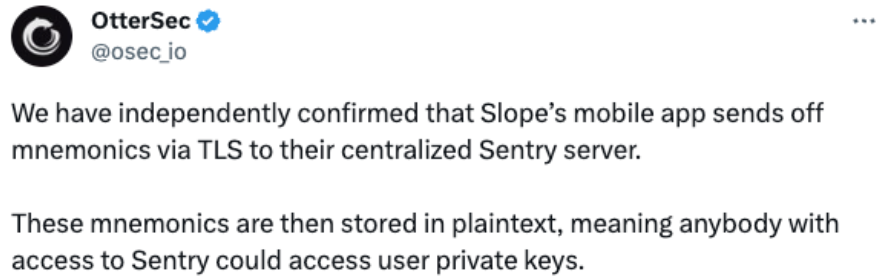

Notes:
- một case study về việc bị mất private key/ seed phases do quá trình phát triển thiếu cẩn thận của developer
- Slope Wallet sử dụng Sentry là một service thứ 3 giúp lưu lại log của ứng dụng giúp cho việc debug, trace lỗi hiệu quả và nhanh tróng
- Sentry SDK trong các ứng dụng sẽ gửi log lên một server tập trung để lưu lại 
- Slope Wallet đã gửi các log bao gồm cả private key của user dẫn tới việc những user có quyền truy cập sentry đều có thể đọc được private keys của người dùng 

---

* Slope Wallet code did attempt to filter out sensitive information in logs, some sensitive information was able to escape unfiltered.
* Specifically, while the message field was filtered (generated in console events), sensitive information included in navigation events would not be filtered.

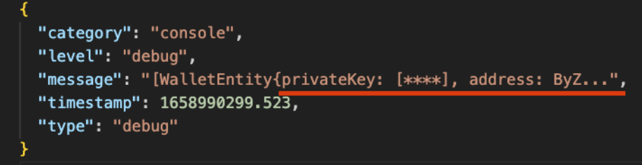

Notes:
- Chúng ta có thể thấy slope wallet đã loại bỏ private key trong console log nhưng không loại bỏ thông tin private key ở các log khác như event navigation này

---

## Solutions

* Filter out sensitive data before sent to 3rd party service 
* Do not store the private key directly on the backend server, use a 3rd party solution such as AWS KMS or HashiCorp Vault instead
* Verify browser extensions before using them
* Thoroughly review actions that require entering a backup seed phrase

Notes:
- Lọc bỏ toàn bộ các thông tin nhạy cảm trước khi gửi lên bất kì các 3rd party service nào
- Không lưu trực tiếp private key trên backend server, có thể tham khảo một số các service như AWS Key Management Service hay Hashicorp Vault để sử dụng nhằm giảm thiểu rủi ro gặp phải
- Luôn verify kĩ càng các browser extensions sử dụng 
- Có thể sử dụng cơ chế multi sig để giảm thiểu rủi ro khi một ví bị chiếm quyền kiểm soát

---

## Traditional Vulnerabilities

* Javascript Injection (eg. NFT poisoning)
* Third party web technologies (eg. Wordpress)
* SQL Injection (User information compromise)
* Remote code execution on infrastructure 

Notes:
Các lỗ hổng bảo mật truyền thống cũng đều có thể bị khai thác ở một hệ thống web3
- NFT là một ví dụ cho việc có thể tấn công XSS qua svg(HTML smuggling)
- Wordpress là 1 hệ thống có nhiều lỗ hổng, nếu triển khai chung với các hệ thống chính có thể dẫn đến việc mất quyền kiểm soát server
- Các lỗi SQL Injection hay Remote code excution cũng đã quá phổ biến
- các diên giả trước cũng đã nói về những phần liên quan đến việc chiêms quyền kiểm soát server thông qua nhiều cách thức, vì vậy e cũng không nói thêm chi tiết phần này 

---

## Administrative Issues

* Private Key Storage 
* Hardware/ Software/ CEX 
* Multi-sig = Multiple signers on a single wallet
* Who can transfer assets or mint token?
* Voting right on proposal 
* DAO
* Who can freeze assets or blacklist wallets?

Notes:
- Rủi ro về mặt quản trị cũng là yếu tố cần xem xét tới
- Việc lưu private key ở đâu 
- Phân quyền multi signers trên 1 ví 
- Phân quyền cho từng wallet việc transfer assets hay mint burn token 
