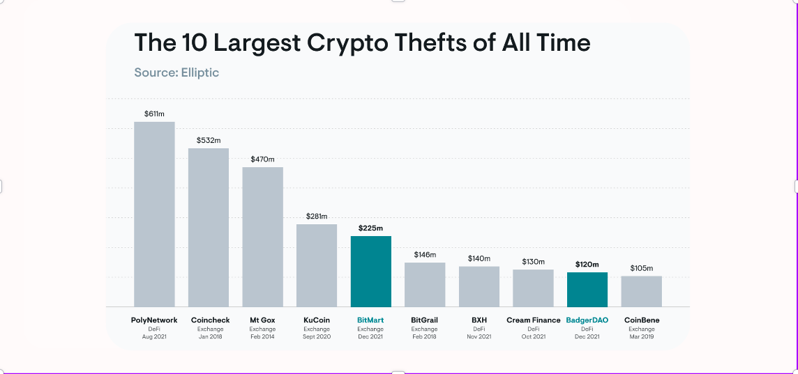
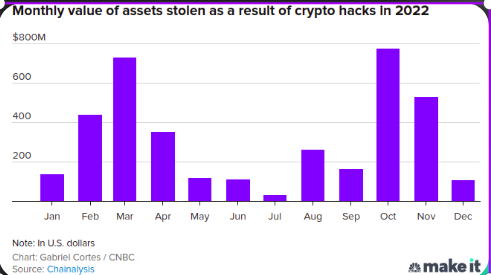
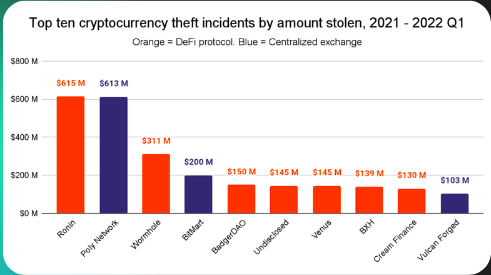
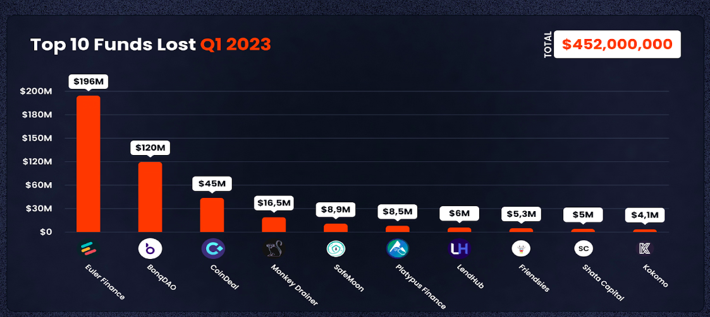

# OpenGuild Community Calls

<pba-flex center>

09/08/2024

</pba-flex>

---

## OpenGuild introduction

Notes:
OpenGuild is an open-source community for Web3 builders interested in the Polkadot ecosystem and Web3 in general. By joining OpenGuild, you will have the opportunity to directly engage with Polkadot development tools, expand your network, and participate in Web3-related events organized by OpenGuild. 🙌 Cheers for your understanding and for being part of this OpenGuild community.

---

## Web3 Cyber Security

---

---

## Crypto investors lost  nearly $4 billion to hackers in 2022

---

---

## Smart contract security

* Smart Contract Exploits
* Oracle exploits
* Randomness Exploits
* Cross-chain exploits
* Web3 security best practices

---

## BEYOND Smart contract security

* WebApp Frontend Attacks
* Private Keys & Seed Phases theft 
* Traditional Vulnerabilities 
* Administrative issues