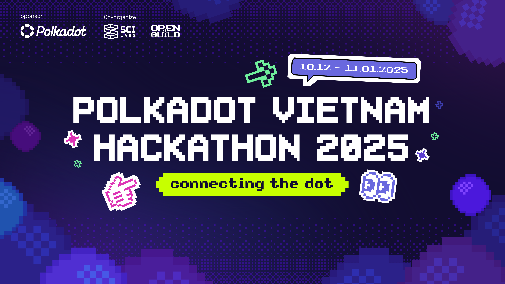
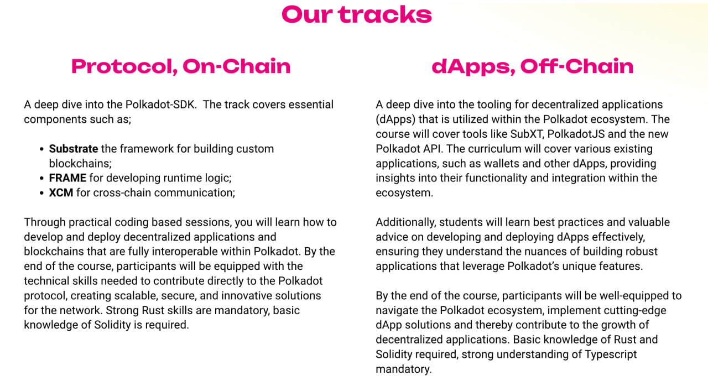
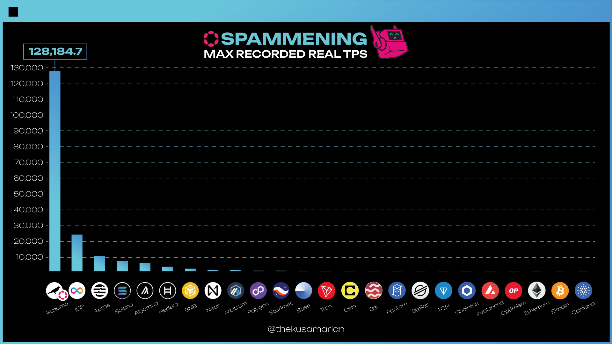

# OpenGuild Community Calls

<pba-flex center>

06/12/2024

</pba-flex>

---

## OpenGuild introduction

Notes:
OpenGuild is an open-source community for Web3 builders interested in the Polkadot ecosystem and Web3 in general. By joining OpenGuild, you will have the opportunity to directly engage with Polkadot development tools, expand your network, and participate in Web3-related events organized by OpenGuild. 🙌 Cheers for your understanding and for being part of this OpenGuild community.

---

## Hackathon

---

## PBA

---

## The Spammening

---

## Defi

* DefiLlama

* Artemis

* ChainEdge

Notes:
defi đang giống với tài chính truyền thống on steroid, bạn có thể truy cập dữ liệu on-chain, đưa ra quyết định đầu tư, không ai care về tech nữa mà chỉ care các dữ liệu on-chain

---

## Defi

* Finding protocols with rising adoption (measured as TVL, fees, volume, etc)

* How to parse out organic vs inorganic growth

* Looking at protocols with high fees compared to their market cap

* Newly listed protocols on DefiLlama

* Tracking VC funding rounds

* Tracking dApp usage by active addresses and gas expenditures

* Tracking smart money flows
